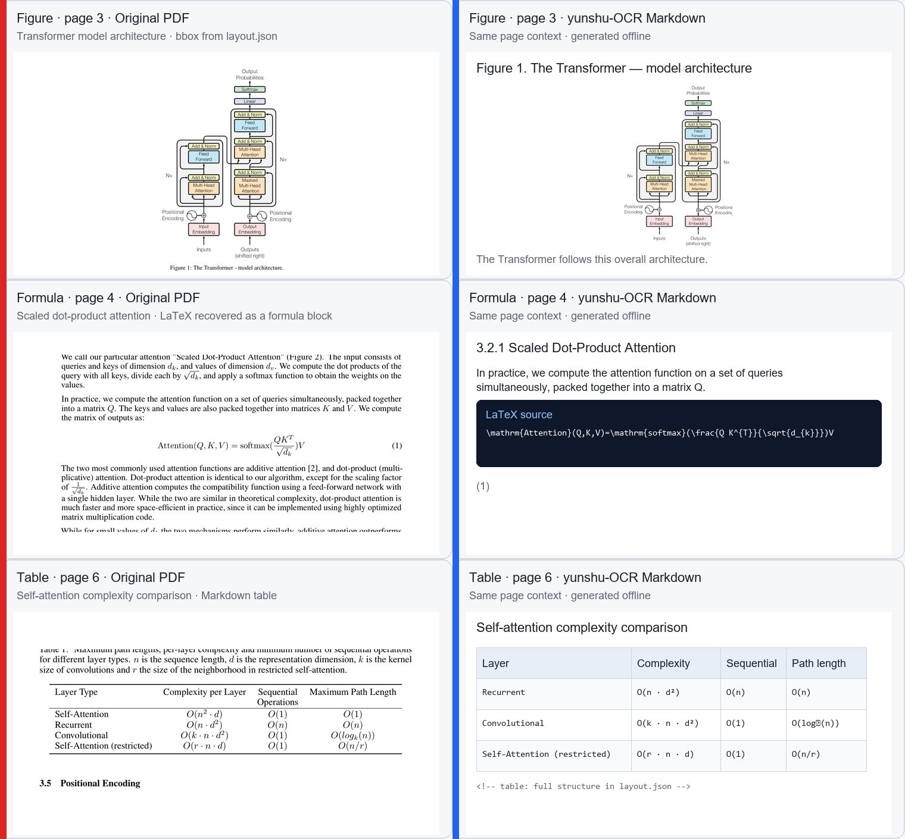

# yunshu-OCR

独立、离线、零 token 的 PDF OCR 与 PDF→Markdown 工具集。

## PDF 内容处理入口

> **当任务涉及阅读、总结、检索、比较、引用或回答 PDF 内容时，请先阅读 [`AI_README.md`](AI_README.md)，再按 [`tools/pdf-reading/README.md`](tools/pdf-reading/README.md) 的流程处理。**
>
> 首选流程：`ensure` PDF → 读取生成的 Markdown → 只有内容不足时再按 `layout.json` 坐标局部 `render`。转换失败才直接读取 PDF。

## 我们解决的用户痛点

| 痛点 | 我们的解法 |
|---|---|
| **AI 读 PDF 成本高**：AI 直接消费 PDF（二进制/整页渲染图）token 开销大，且无法结构化读取 | 把 PDF 转成**规范化 Markdown**，AI 只读 MD 省 token；`layout.json` 提供 PDF↔MD 绑定溯源，MD 不足时按需渲染局部 |
| **表格识别不准**：数据表内容丢失、单元格错位、图片型表格无法提取 | 策略阶梯（原生几何 → PyMuPDF → OCR 几何 → SLANet 模型 → 图片+标记），质量门控绝不硬猜；位图表可经 OCR 重建转 MD |
| **公式难恢复**：扫描件公式、LaTeX 排版文字层损坏 | pix2tex 优先，RapidOCR + 符号映射兜底 |
| **隐私与成本**：在线 OCR/LLM 有泄露与费用顾虑 | **全链路离线、CPU 可跑、不消耗任何 LLM token** |
| **溯源缺失**：转换结果无法对应回 PDF 原文位置 | `layout.json` 逐元素记录 `page` + `bbox_pdf`，可按需渲染定位 |

本仓库由两个协同组件组成，均可单独使用：

| 组件 | 目录 | 职责 |
|---|---|---|
| **OCR 工具集** | `tools/` + `models/` | 对 PDF 区域跑 OCR（子进程隔离、内存/时间上限），用原生文本诊断判断是否需要 OCR |
| **pdf2md** | `pdf2md/` | 把 PDF 转成规范化 Markdown，供任意 AI 直接消费，全链路离线、**不消耗任何 LLM token** |

核心思路沿自 litwise 文献阅读家族：**原始 PDF 是不可变的视觉来源，OCR 只用来补救原生文本失败的区域**，公式/表格/图片用版面检测 + 专用模型恢复。

---

## 特性

- **OCR 工具集**
  - 独立子进程运行 OCR，监控 RSS 与超时，崩溃/超内存不拖垮宿主进程
  - 结果带页码、PDF 坐标、置信度，序列化契约稳定（`OCRRegionRequest` / `OCRCandidate` / `OCRJobResult`）
  - 页面诊断：用 PyMuPDF 原生文本判断每页走 `native` / `ocr` / `manual_review`
  - 生产 RapidOCR 适配器（onnxruntime CPU，中文 PP-OCRv4 权重约 16MB 随目录落地）
- **pdf2md**
  - 全离线转换，不消耗任何 LLM token
  - 版面检测（doclayout_yolo）→ 文字/图片/表格提取 → 内容分类 → 阅读顺序 → 规范化 Markdown
  - **双栏阅读顺序**：栏距检测 + 栏感知排序（左栏读完再右栏，单栏自动回退全局 y 序）
  - **PDF 预检档案**：采样判断原生/扫描/混合，预估耗时瓶颈（report.json / CLI 提示）
  - **公式识别**：pix2tex 优先；公式少自动跳过（省 ~27s 模型加载）；缺失回退 RapidOCR + 符号映射
  - **表格识别**：策略阶梯（几何/PyMuPDF/OCR 位图救援/SLANet 模型）+ 图表/位图守卫防误判；跨页续表保守合并
  - 输出自带溯源（`layout.json`）与转换报告（`report.json`）

## 真实效果预览

下面这张图来自公开的 [Attention Is All You Need](https://arxiv.org/abs/1706.03762) arXiv PDF（论文首页明确允许在学术/新闻作品中、带署名转载表格与图片）。左侧是原始 PDF 的局部上下文，右侧是 `yunshu-OCR` 离线生成的 Markdown 上下文；三行分别展示图片、公式和表格。



右侧现在按 Markdown 的阅读效果渲染了标题、段落、图片和表格；公式仍保留为实际输出中的 LaTeX 源码块，因为 `yunshu-OCR` 的公式契约就是交给下游 LaTeX 渲染器。图片相对路径、表格结构和 `layout.json` 中的 PDF 坐标仍来自同一轮转换。样例 PDF 不提交到仓库，来源、SHA-256 和重建命令见 [`docs/assets/attention-is-all-you-need-source.md`](docs/assets/attention-is-all-you-need-source.md)。

---

## 项目结构

```text
yunshu-OCR/
├── README.md                     # 本文件（痛点 + 用法）
├── AI_README.md                  # 给 AI 直接阅读的能力摘要
├── requirements.txt              # 运行依赖范围
├── requirements-lock.txt         # Windows / Python 3.13 已验证运行时版本
├── requirements-dev.txt          # 维护者测试依赖范围（仅 Git 仓库）
├── requirements-dev-lock.txt     # 维护者测试依赖锁定（仅 Git 仓库）
├── .gitignore                    # 排除 __pycache__、模型权重、测试数据
│
├── tools/                        # ◀ 组件一：OCR 工具集
│   ├── ocr_worker.py             #   子进程 OCR worker（RSS/超时监控）
│   ├── ocr_contracts.py          #   序列化契约（请求/候选/结果）
│   ├── page_diagnostics.py       #   页面信号提取与状态诊断
│   └── resource_limits.py        #   内存/DPI/批量页资源策略
│   └── pdf-reading/              #   PDF↔Markdown 绑定读取工具
│       ├── README.md              #   使用流程与安全边界
│       └── pdf2md.py             #   ensure/info/render，输出 JSON
│
├── models/models.lock.json       # 固定 Release、文件大小与 SHA-256
├── models/production/
│   └── rapidocr-adapter/         #   vendored RapidOCR 适配器（v3.4.x, onnxruntime）
│       └── rapidocr/models/      #   PP-OCRv4 det/rec + cls onnx 权重、字典、字体
│
├── pdf2md/                       # ◀ 组件二：PDF→Markdown
│   ├── cli.py / pipeline.py      #   CLI 入口 / 转换主链路
│   ├── layout.py                 #   版面检测（doclayout_yolo）
│   ├── reading_order.py          #   双栏栏距检测 + 栏感知阅读顺序
│   ├── pdf_profile.py            #   PDF 预检档案（原生/扫描/混合 + 瓶颈）
│   ├── tables.py                 #   表格策略阶梯（再导出各子模块）
│   ├── table_geometry.py         #   表格几何重建（行列聚类/质量/对齐）
│   ├── table_detect.py           #   无框表候选 / 图表/位图/散文/公式守卫
│   ├── table_merge.py            #   跨页续表合并（表头相似度门槛）
│   ├── table_html.py / table_model.py  #   Table 模型 / SLANet 结构引擎
│   ├── teds.py / benchmark.py    #   表格质量度量 / 基准
│   ├── classify.py / order.py    #   内容分类 / 阅读顺序
│   ├── formulas.py / ocr.py      #   公式识别 / OCR 兜底
│   ├── normalize.py / lint.py    #   Markdown 规范化 / 质量 lint
│   ├── sidecar.py / textloss.py  #   溯源 / 文字不丢失
│   └── README.md                 #   组件独立文档（输出契约、实测结果）
│
├── scripts/
│   └── ocr_demo.py               # OCR 真实输出检测 demo
│
├── tests/                        # OCR 工具集测试（仅 Git 仓库）
├── pdf2md/tests/                 # pdf2md 测试（仅 Git 仓库）
│
└── docs/
    ├── OCR流程完整说明.md           # OCR 流程、置信度门禁、排错
    ├── PDF转Markdown零token工具实现计划.md  # pdf2md 设计决策
    ├── 表格识别强化方案.md           # 表格识别架构与实测
    ├── PDF与Markdown绑定读取技能设计.md    # PDF↔Markdown 绑定读取工具设计
    └── VENDORED.md                 # vendored 供应链记录
```

---

## 环境要求

- Python **3.10+**（已在 3.13 验证）
- Windows / Linux / macOS
- CPU 即可（onnxruntime CPU 推理）；GPU 可选但非必需

---

## 安装

```powershell
cd <yunshu-OCR 项目目录>

# 安装已经固定版本的 Windows / Python 3.13 运行时依赖闭包
python -m pip install -r requirements-lock.txt

# 安装 models-v1 Release 中的 7 个模型文件，并逐文件校验大小与 SHA-256
python -m pdf2md.models install
python -m pdf2md.models verify
```

安装模型时允许联网访问固定的 GitHub Release；PDF 转换本身默认严格离线，不访问云端 API、
不下载模型，也不消耗 LLM token。模型缺失、版本不符或校验失败时，转换会在创建输出目录前失败，
并提示重新运行安装命令。可用 `python -m pdf2md.models status` 随时检查本地状态。

`requirements.txt` 与 `pdf2md/requirements.txt` 保留宽松版本范围；发布运行优先使用
`requirements-lock.txt`。维护者如需运行测试，再安装 `requirements-dev-lock.txt`。当前锁文件针对
Windows amd64 / Python 3.13。

---

## 使用方法

### 组件一：OCR 工具集（`tools/`）

#### A. Python API — 直接对 PDF 区域做 OCR

```python
import sys
from pathlib import Path

sys.path.insert(0, str(Path(__file__).resolve().parent / "tools"))

from ocr_contracts import OCRRegionRequest
from ocr_worker import run_ocr_job

request = OCRRegionRequest(
    job_id="manual-p1",
    pdf_path=r"E:\papers\sample.pdf",
    page=1,
    regions=[[40.0, 100.0, 560.0, 740.0]],  # PDF 坐标 bbox
    engine="production",                     # 或 "fake" 用于无模型环境测试
    language="zh",
    dpi=220,
    max_ram_bytes=8 * 1024**3,
)

result = run_ocr_job(request, timeout_seconds=120)
for item in result.regions:
    print(item.text, item.confidence, item.bbox_pdf)
print(result.error, result.peak_rss_bytes, result.duration_ms)
```

#### B. Python API — 页面诊断（判断是否触发 OCR）

```python
from page_diagnostics import extract_page_signals, diagnose_page

signals = extract_page_signals(r"E:\papers\sample.pdf")
for signal in signals:
    result = diagnose_page(signal)
    print(signal.page, result.status, result.reasons, result.repair_regions)
```

#### C. 命令行 Demo

```bash
python scripts/ocr_demo.py <pdf路径> [页码...] [--output 目录]
```

不带页码：对全文逐页做页面诊断，汇总状态分布；带页码：额外对指定页跑真实 RapidOCR，输出识别文本、置信度、耗时与峰值内存。结果写到 `<pdf名>.ocr.json` 与 `<pdf名>.ocr.md`。

### 组件二：pdf2md（`pdf2md/`）

#### A. CLI 转换

```bash
python -m pdf2md.cli <input.pdf> --output <out>
```

| 参数 | 默认 | 说明 |
|---|---|---|
| `--output` | 输入同目录 `<name>_pdf2md` | 输出目录 |
| `--lang` | en | zh / en |
| `--drop-margins` | 保留 | 删除页眉页脚（默认标注保留） |
| `--no-ocr` | 关 | 跳过 OCR 兜底 |
| `--formula-engine` | auto | auto / pix2tex / rapidocr |
| `--offline` | 开 | 严格离线转换（当前始终启用） |
| `--dpi` / `--formula-dpi` / `--image-dpi` | 220 / 300 / 200 | OCR / 公式 / 图片 DPI |
| `--max-pages` | 全部 | 只处理前 N 页 |

#### B. 输出契约

每个 PDF 产出：

```text
<out>/
├── <name>.md        # 唯一最终产物
├── images/          # 图片单独存放，MD 相对路径引用
├── layout.json      # 溯源：逐页元素 + bbox + 页眉页脚 + 降级标记
└── report.json      # 转换报告（指标 / 覆盖率 / 元数据）
```

`<name>.md` 结构：顶部 `> 元数据块` → `## Page N` 分页 → 正文 / `` ```latex `` 公式代码块 / MD 表格 / `` / `<!-- header -->…<!-- /header -->` 页眉页脚标注保留。

#### C. 质量检查

```bash
python -m pdf2md.lint <生成的.md>   # 已知失败模式 lint（目录标题/正文标题/公式合并/公式乱码）
```

完整参数、实测结果与已知限制见 [`pdf2md/README.md`](pdf2md/README.md)。

---

## 测试

```powershell
# 仅适用于 Git 开发仓库；源码 Release 不包含测试文件
python -m pip install -r requirements-dev-lock.txt
python -m pytest tests/ pdf2md/tests/

# 按组件
python -m pytest tests/
python -m pytest pdf2md/tests/
```

---

## 文档

- [`AI_README.md`](AI_README.md) — **给 AI 直接阅读的能力摘要**（调用方式、输出契约、可靠性、最佳实践）
- [`docs/OCR流程完整说明.md`](docs/OCR流程完整说明.md) — OCR 工具集完整流程、置信度门禁与排错
- [`docs/PDF转Markdown零token工具实现计划.md`](docs/PDF转Markdown零token工具实现计划.md) — pdf2md 设计决策与输出契约
- [`docs/表格识别强化方案.md`](docs/表格识别强化方案.md) — 表格识别架构与实测
- [`docs/PDF与Markdown绑定读取技能设计.md`](docs/PDF与Markdown绑定读取技能设计.md) — PDF↔Markdown 绑定读取工具设计
- [`tools/pdf-reading/`](tools/pdf-reading/) — **PDF→Markdown 绑定读取工具**（AI 读 MD、用户操作 PDF）
- [`docs/VENDORED.md`](docs/VENDORED.md) — vendored 第三方代码/权重供应链记录（来源/版本/许可/哈希）

---

## 开源致谢

本仓库的代码源自内部 litwise 文献阅读家族项目的提取与合并；第三方能力直接复用以下开源项目，在此致谢：

### 项目许可证

除明确标注的第三方代码、模型、字体和其他资产外，本仓库原创代码采用
[GNU Affero General Public License v3.0 only](LICENSE)（`AGPL-3.0-only`）授权。
如果修改后的版本通过网络向用户提供服务，AGPL 第 13 条通常要求向这些用户提供对应源代码。

第三方组件继续适用各自的许可证与版权声明，不因仓库级许可证而被重新授权。具体边界见
[`NOTICE`](NOTICE)、[`docs/VENDORED.md`](docs/VENDORED.md) 和
[`THIRD_PARTY_LICENSES/`](THIRD_PARTY_LICENSES/)。

### 直接复用的核心组件

| 开源项目 | 版本 | 用途 | License |
|---|---|---|---|
| **RapidOCR** | vendored v3.4.x | 中文/英文 OCR 推理后端（`models/production/rapidocr-adapter/`，onnxruntime CPU） | Apache-2.0 |
| **PaddleOCR（PP-OCRv4 模型）** | det / rec / cls | 检测、识别、方向分类的 `.onnx` 权重（随适配器落地） | Apache-2.0 |
| **doclayout_yolo** | ≥ 0.0.2b1 | PDF 版面检测（`pdf2md/layout.py`，YOLOv10 派生） | AGPL-3.0-only |
| **pix2tex / LaTeX-OCR** | 0.1.4 | 公式图片→LaTeX（代码 MIT；默认转换所需） | 权重为 CC-BY-NC-SA-4.0 |
| **PyMuPDF（MuPDF/fitz）** | ≥ 1.23.0 | PDF 渲染与文字/图片提取（`tools/`、`pdf2md/text.py`） | AGPL-3.0 |
| **ONNX Runtime** | ≥ 1.17.0 | RapidOCR 的推理执行引擎 | MIT |

### 运行时依赖

`numpy`（BSD-3）、`opencv-python`（Apache-2.0）、`Pillow`（HPND）、`omegaconf`（BSD-3）、`pyclipper`（MIT）、`shapely`（BSD-3）、`colorlog`（MIT）、`requests`（Apache-2.0）、`tqdm`（MIT）、`psutil`（BSD-3）。维护者测试工具另见 `requirements-dev-lock.txt`。

### 模型与字体

- 7 个运行时权重不进入 Git 历史，由 `models-v1` Release 统一安装；文件级哈希见
  `models/models.lock.json`，Release ZIP 的供应链记录见 `docs/VENDORED.md`。
- `.onnx` 权重由 RapidAI 从 PaddleOCR 导出，上游标注为 Apache-2.0。
- `FZYTK.TTF` 不在 Release 中，转换推理不构造字体可视化器，因此运行不需要该字体。
- pix2tex 加载代码版本为 0.1.4；两个权重来自上游 v0.0.1 权重 Release，采用
  `CC-BY-NC-SA-4.0`，转换期间不会再下载。该权重许可证包含非商业限制。

> **许可提示**：仓库级 `AGPL-3.0-only` 只覆盖本项目有权授权的原创代码；第三方模型分别遵循其原始条款。模型 ZIP 已随附许可与署名材料，但 pix2tex 权重仍仅限非商业使用。详见 [`模型 Release 再分发许可核验`](docs/research/model-release-redistribution-audit-2026-08-11.md)。

---

## 已知限制

- 当前只有 RapidOCR 单模型，系统置信度上限 0.94，低置信度结果需人工复核。
- 复杂表格、公式和部分旧式扫描件可能无法自动恢复（OCR 兜底页带 `<!-- ocr:page -->` 标记供复核）。
- 公式主引擎 pix2tex 对等式编号、`v/y/ν` 等偶有误读；**复杂公式图 OCR 可能产出乱码 LaTeX**（`is_real_formula` 守卫部分拦截）；RapidOCR 兜底是"近似 LaTeX"。
- **表格识别**：策略阶梯（原生几何 → PyMuPDF 有框表 → OCR 几何位图表救援 → SLANet 结构模型 → 图片+标记）。图片型表格可经 OCR 重建转 MD；合并单元格 MD 用展开复制（无损 HTML 入 layout.json）。**图表/位图守卫**防曲线图与显微照片被误判成表格。详见 `docs/表格识别强化方案.md`。
- 跨页续表已按保守规则合并（表头相似度门槛防误并）。
- **双栏阅读顺序**：栏距检测 + 左栏先右栏（单栏自动回退全局 y 序）。YOLO 偶把左右栏合并成通栏区域时会产生句界冗余段，需版面层区域合并根治。
- 图/表多的论文转换较慢（每区域触发提取），预检会提示瓶颈。
